# Image segmentation based on ResUnet model for road detection with Keras
This project aims detect and extract roads in satellite images with help of ResUnet image segmentation model. All code for ResUnet model was written in Jupyter notebook and C++ codes was used to prepare dataset for training process and one python file was used to remove noise from binarized masks. 

## Libraries

 - Keras
 - PIL
 - Numpy
 - OpenCV
 - H5py
 - Matplotlib

# Model 

RESUNET refers to Deep Residual UNET. It’s an encoder-decoder architecture developed by Zhengxin Zhang et al. for semantic segmentation. It was adopted by researchers for multiple applications such as polyp segmentation, brain tumour segmentation, human image segmentation, and many more. 

RESUNET is a fully convolutional neural network that is designed to get high performance with fewer parameters. It is an improvement over the existing UNET architecture. RESUNET takes the advantage of both the UNET architecture and the Deep Residual Learning.

# Dataset 
Dataset can be download by link: https://people.eecs.berkeley.edu/~tinghuiz/projects/pix2pix/datasets/maps.tar.gz

Dataset for this project consists of 2180 images where 2100 of them was used for traning process. Each image has 1200 X 600 pixels where left half part of those images represent satellite images. C++ files in "splitter" folder was used to split images two equal parts which must have 600 X 600 pixels for each image. After splitting process, C++ files in "thresholder" folder was used to create masks for training process. Mask is just binarized version of input images where value of pixels greater than 250 must be mapped to 255 and other pixels must be mapped to 0. Jupyter file Format_Dataset.ipynb was used to change the size of input images and masks which must have 256 X 256 pixels for U-net model. ...

The following images illustrate the example, splitted version and mask respectively:

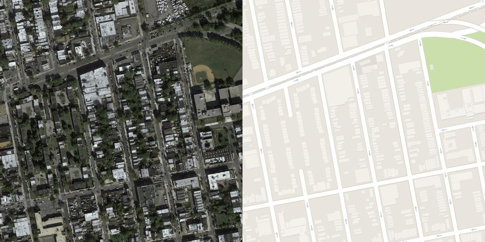

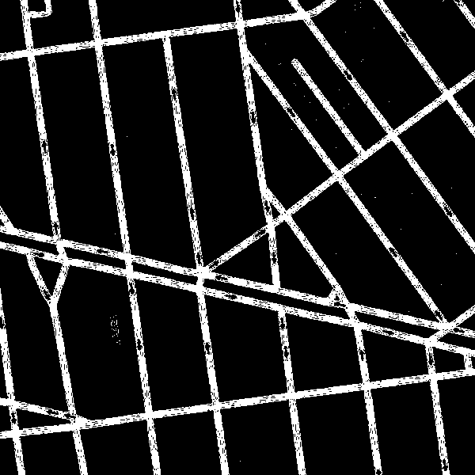

# Dice Similarity

The Dice similarity coefficient, also known as the Sørensen–Dice index or simply Dice coefficient, is a statistical tool which measures the similarity between two sets of data. This index has become arguably the most broadly used tool in the validation of image segmentation algorithms created with AI.

Dice coefficient can be calculated by formula:

# Training

U-net model was trained by 60 epochs. At the end of process training accuracy and dice coefficient reached 93% and 83% respectively. 

## Predictions

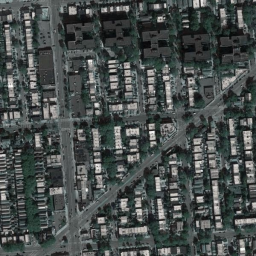
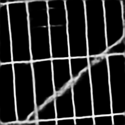
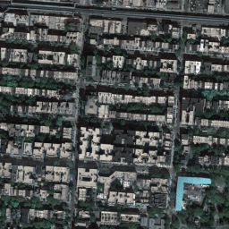

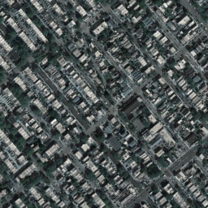
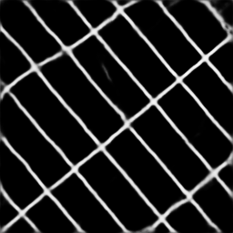
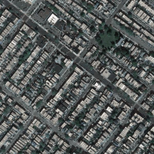
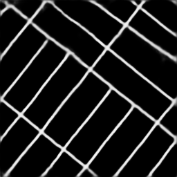

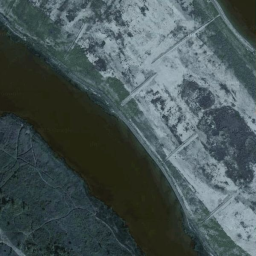
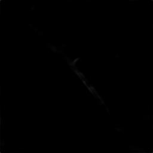

# References
Papers: [Arxiv](https://arxiv.org/abs/1505.04597) ,
        [Arxiv](https://arxiv.org/pdf/1904.00592.pdf) 
Dataset: https://people.eecs.berkeley.edu/~tinghuiz/projects/pix2pix/datasets/maps.tar.gz

 
